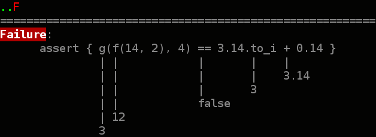

% kamiyama.rb 2
% ka
% 2015-09-21

# Author

ka

Website: [kaosfield](http://www.kaosfield.net)

Twitter: [ka](https://twitter.com/ka_)

GitHub: [kaosf](https://github.com/kaosf)

# はじめに

このスライドは公開されています

このスライドのリポジトリは[https://github.com/kaosf/20150921-kamiyamarb-slide](https://github.com/kaosf/20150921-kamiyamarb-slide)にあります

間違いを発見したら Issue あるいは PullRequest を下さると嬉しいです

### License

[CC BY-NC-SA 4.0](http://creativecommons.org/licenses/by-nc-sa/4.0/)

Copyright (C) 2015 ka

# 去る8月30日

tokushima.rb会場にて

- dan「神山.rbやりますー発表してくれる人ー」
- か「まぁネタが無いわけじゃないしやってもいいですけど…」
- dan「じゃあもう書いて告知しますね」
- か「ファッ！？」

# 発表するのはやぶさかではない

- か「言うて発表するのそないに嫌いちゃうねん」
- か「けどOSS普及協議会のスライド作るんもあるし…」
- か「大体なんで毎回tokushimar.rbで発表してるのうちだけやねん…」
- このままではヘイトが急上昇してしまう

# ニコ動でここ数年見てる動画

ひたすら楽して○○シリーズ

- ひたすら楽してFF5
- ひたすら楽してFF6
- ひたすら楽してFF4
- ひたすら楽してFF9 ←現在Part2まで上がってる
- <span style="color:#ddd">おうロマサガ3あくしろよ</span>

# ひたすら楽して神山.rb

- ぬわあああああん疲れたもおおおおん
- 限りなく楽をしてスライドを作ろう
- スライドの内容を全部コピペで済ませよう
- 推敲するのやめよう
- それっぽいページだけパパパっと作って終わり！
- 多分これが一番楽だと思います

#

はいよーいスタート

# プリキュアハッカソンに参加してきました

[プリキュアハッカソン 3 - connpass](http://connpass.com/event/17280/)


プリキュアの映画を見ながらテンションを高めることにより進捗を得る

**最高感ある**

# rubicure_fuzzy_match

Rubicureというgemに曖昧検索機能を追加するgemを作った

本体を改造するのではなく後からメソッドを追加する方針

それを読み込むだけでrubicureもそのまま使えるし追加機能も使える

`rspec-rails`とか`factory_girl_rails`のノリ

<ul>
<li>リポジトリ: [kaosf/rubicure_fuzzy_match](https://github.com/kaosf/rubicure_fuzzy_match)</li>
<li>スライド: [Rubicureをあいまい検索対応強化してみた](http://kaosf.github.io/rubicure-fuzzy-match-slide)</li>
</ul>

# `Rubicure::Seriese` に `fuzzy_find` が追加される

<div class="incremental">
```ruby
Rubicure::Seriese.fuzzy_find 'yesgogo'
#=> {:series_name=>"yes_gogo", :title=>"Yes！ プリキュア5 Go Go！", :started_date=>Sun, 03 Feb 2008, :ended_date=>Sun, 25 Jan 2009, :girls=>["cure_dream", "cure_rouge", "cure_lemonade", "cure_mint", "cure_aqua", "milky_rose"]}
```

```ruby
Rubicure::Seriese.fuzzy_find 'yes gogo'
#=> {:series_name=>"yes_gogo", :title=>"Yes！ プリキュア5 Go Go！", :started_date=>Sun, 03 Feb 2008, :ended_date=>Sun, 25 Jan 2009, :girls=>["cure_dream", "cure_rouge", "cure_lemonade", "cure_mint", "cure_aqua", "milky_rose"]}
```

```ruby
Rubicure::Seriese.fuzzy_find '5 gogo'
#=> {:series_name=>"yes_gogo", :title=>"Yes！ プリキュア5 Go Go！", :started_date=>Sun, 03 Feb 2008, :ended_date=>Sun, 25 Jan 2009, :girls=>["cure_dream", "cure_rouge", "cure_lemonade", "cure_mint", "cure_aqua", "milky_rose"]}
```

```ruby
Rubicure::Seriese.fuzzy_find '555'
#=> {:series_name=>"yes_gogo", :title=>"Yes！ プリキュア5 Go Go！", :started_date=>Sun, 03 Feb 2008, :ended_date=>Sun, 25 Jan 2009, :girls=>["cure_dream", "cure_rouge", "cure_lemonade", "cure_mint", "cure_aqua", "milky_rose"]}
```
</div>

# かなり適当な検索で作品を取ってこれる

```ruby
Rubicure::Seriese.fuzzy_find 'ss'
#=> {:series_name=>"splash_star", :title=>"ふたりはプリキュア Splash☆Star", :started_date=>Sun, 05 Feb 2006, :ended_date=>Sun, 28 Jan 2007, :girls=>["cure_bloom", "cure_egret"]}

Rubicure::Seriese.fuzzy_find 'ゴプリ'
#=> {:series_name=>"go_princess", :title=>"Go!プリンセスプリキュア", :started_date=>Sun, 01 Feb 2015, :girls=>["cure_flora", "cure_mermaid", "cure_twinkle", "cure_scarlett"]}

Rubicure::Seriese.fuzzy_find 'ハト'
#=> {:series_name=>"heart_catch", :title=>"ハートキャッチプリキュア！", :started_date=>Sun, 07 Feb 2010, :ended_date=>Sun, 30 Jan 2011, :girls=>["cure_blossom", "cure_marine", "cure_sunshine", "cure_moonlight"]}

Rubicure::Seriese.fuzzy_find '姫プリ'
#=> {:series_name=>"go_princess", :title=>"Go!プリンセスプリキュア", :started_date=>Sun, 01 Feb 2015, :girls=>["cure_flora", "cure_mermaid", "cure_twinkle", "cure_scarlett"]}
```

# 作品名の正規化

`Rubicure::Seriese.regularize` メソッドで正規化が出来る

```ruby
Rubicure::Seriese.regularize 'splashstar' #=> "ふたりはプリキュア Splash☆Star"
Rubicure::Seriese.regularize 'スマプリ' #=> "スマイルプリキュア！"
Rubicure::Seriese.regularize 'スマイプリ' #=> "スマイルプリキュア！"
Rubicure::Seriese.regularize 'ハピチャ' #=> "ハピネスチャージプリキュア！"
```

# fuzzy_matchという面白そうなgem

あいまい検索が出来るようになる

[seamusabshere/fuzzy_match](https://github.com/seamusabshere/fuzzy_match)

```ruby
require 'fuzzy_match'

fm = FuzzyMatch.new ['プリキュア', 'ナージャ']
fm.find 'ナンジャ' #=> "ナージャ"
fm.find 'プリプリ' #=> "プリキュア"
fm.find 'どれみ'   #=> nil
```

# test-unit

RSpecを無理して使う時代ではもう無い

test-unitを使ってみている

[Ruby - Test::Unitでテストを書く - Qiita](http://qiita.com/repeatedly/items/727b08599d87af7fa671)

# ディレクトリ構成

```
+ lib/
  - rubicure_fuzzy_match.rb
+ test/
  - test_rubicure_fuzzy_match.rb
- Rakefile
```

# Rakefile

```ruby
require "bundler/gem_tasks"
require "rake/testtask"

Rake::TestTask.new do |t|
  t.libs << "test"
  t.test_files = Dir["test/**/test_*.rb"]
  t.verbose = true
end

task default: :test
```

参考: [class Rake::TestTask (Ruby 2.2.0)](http://docs.ruby-lang.org/ja/2.2.0/class/Rake=3a=3aTestTask.html)

# Rakefile

これで

```sh
rake
```

ないし

```sh
rake test
```

でテストが走る

# power_assertこそパワー

以下のようなテスト

```ruby
test 'power_assert' do
  assert { g(f(14, 2), 4) == 3.14.to_i + 0.14 }
end
```

**ブロックの評価結果がtrueになることをassert** …というノリで読めば良い

# 見よこの美しいエラー表示を

```
Failure:
      assert { g(f(14, 2), 4) == 3.14.to_i + 0.14 }
               | |            |       |    |
               | |            |       |    3.14
               | |            |       3
               | |            false
               | 12
               3
test_power_assert(TestA)
/home/username/.rbenv/versions/2.2.3/lib/ruby/gems/2.2.0/gems/power_as(略)
test/test_a.rb:14:in `test_power_assert'
     11:   end
     12: 
     13:   def test_power_assert
  => 14:     assert { g(f(14, 2), 4) == 3.14.to_i + 0.14 }
     15:   end
     16: end
```

# 見よこの美しいエラー表示を



# データ駆動テスト出来る

```ruby
class TestRubicureFuzzyMatch < Test::Unit::TestCase
  data(
    "ふたり"      => ["ふたり"     , "ふたりはプリキュア"            ],
    "初代"        => ["初代"       , "ふたりはプリキュア"            ],
    ...
    "姫プリ"      => ["姫プリ"     , "Go!プリンセスプリキュア"       ])
  test '.regularize' do |(input, expected)|
    assert_equal expected, Rubicure::Seriese.regularize(input)
  end
  ...
end
```

#

さすがにコピペでは無理になってきたのでここからはもう書き下ろしする

# 分配束縛について

```ruby
data(
  "a" => [1, 2],
  "b" => [3, 4],
  "c" => [5, 6])
test '' do |data|
  p data
end

#=>
# [1, 2]
# [3, 4]
# [5, 6]
```

# 分配束縛について

```ruby
data(
  "a" => [1, 2],
  "b" => [3, 4],
  "c" => [5, 6])
test '' do |(x, y)|
  p [y, x]
end

#=>
# [2, 1]
# [4, 3]
# [6, 5]
```

こう書ける

# 分配束縛について

今まではこうだった

```ruby
class TestRubicureFuzzyMatch < Test::Unit::TestCase
  data(
    "姫プリ" => ["姫プリ" , "Go!プリンセスプリキュア"])
  test '.regularize' do |data|
    assert_equal data[1], Rubicure::Seriese.regularize(data[0])
  end
end
```

# 分配束縛について

こっちの方が意味が分かりやすい

```ruby
class TestRubicureFuzzyMatch < Test::Unit::TestCase
  data(
    "姫プリ" => ["姫プリ" , "Go!プリンセスプリキュア"])
  test '.regularize' do |(input, expected)|
    assert_equal expected, Rubicure::Seriese.regularize(input)
  end
end
```

# test

```ruby
class TestFoo < Test::Unit::TestCase
  def test_foo
    assert true
  end
end
```

これだとテスト名前がメソッド名でなければならないという制限に引きずられる引きずられる

```ruby
class TestFoo < Test::Unit::TestCase
  test 'foo' do
    assert true
  end
end
```

こう書ける(RSpecの`it`みたいな)

# ネタが尽きた

まとめ

RSpecもいいけどtest-unitもね
